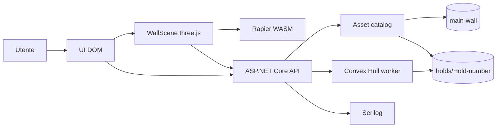
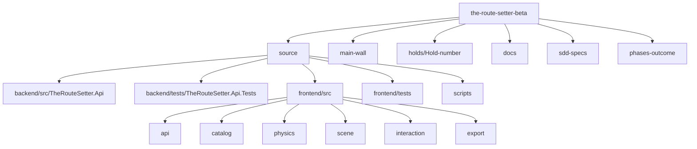
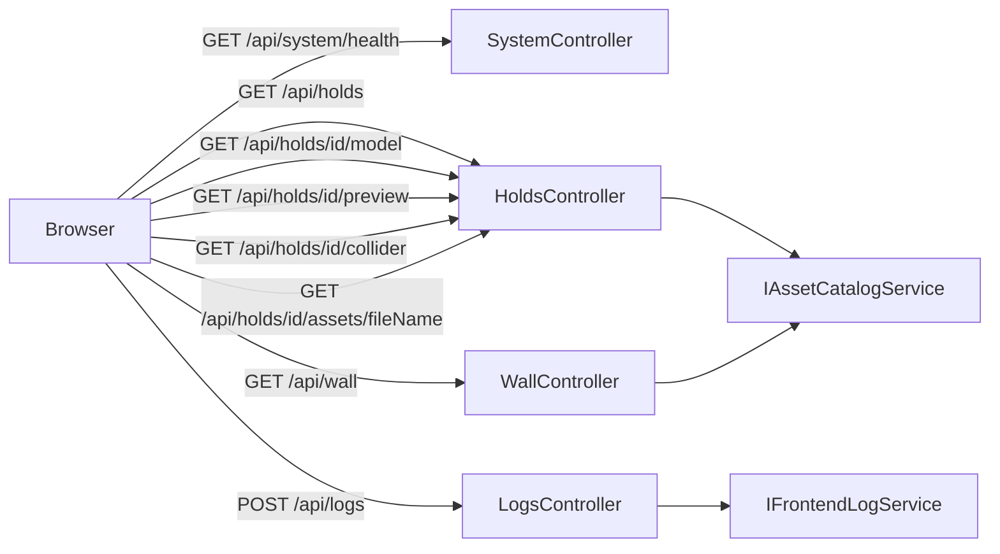
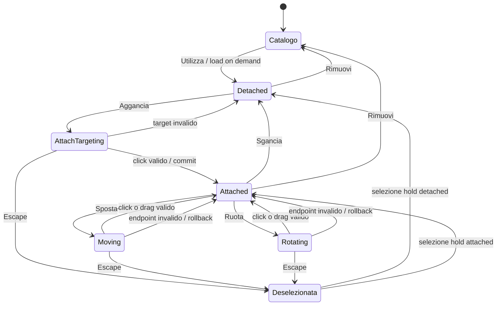
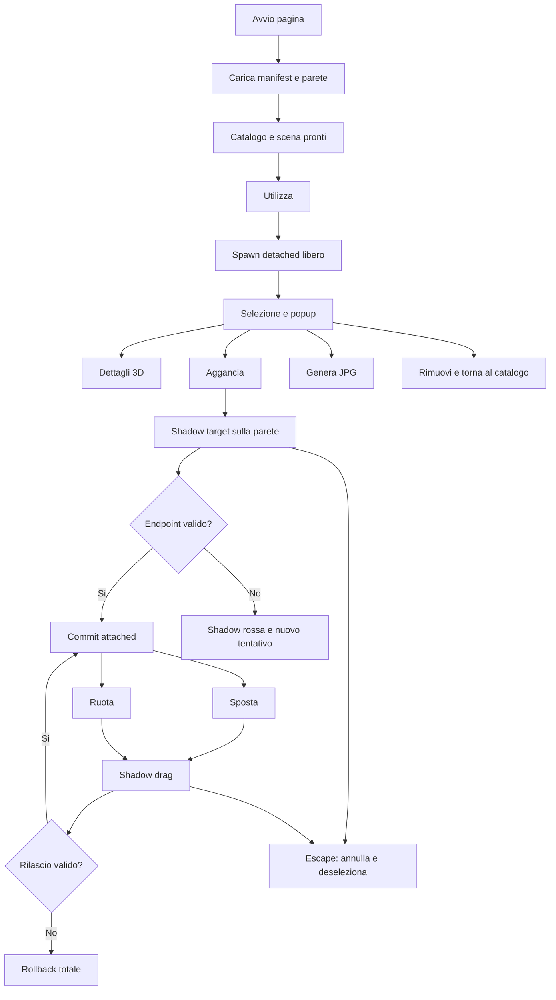
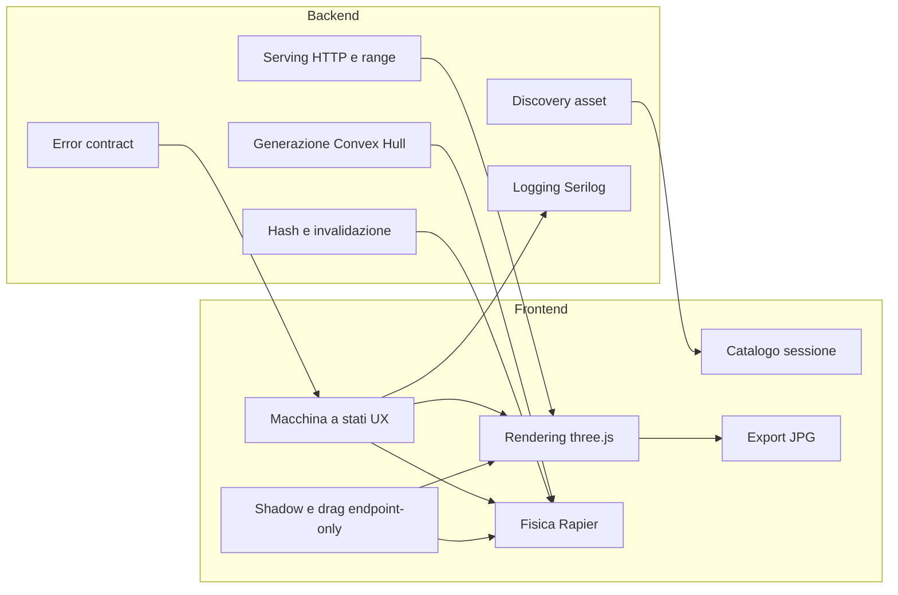
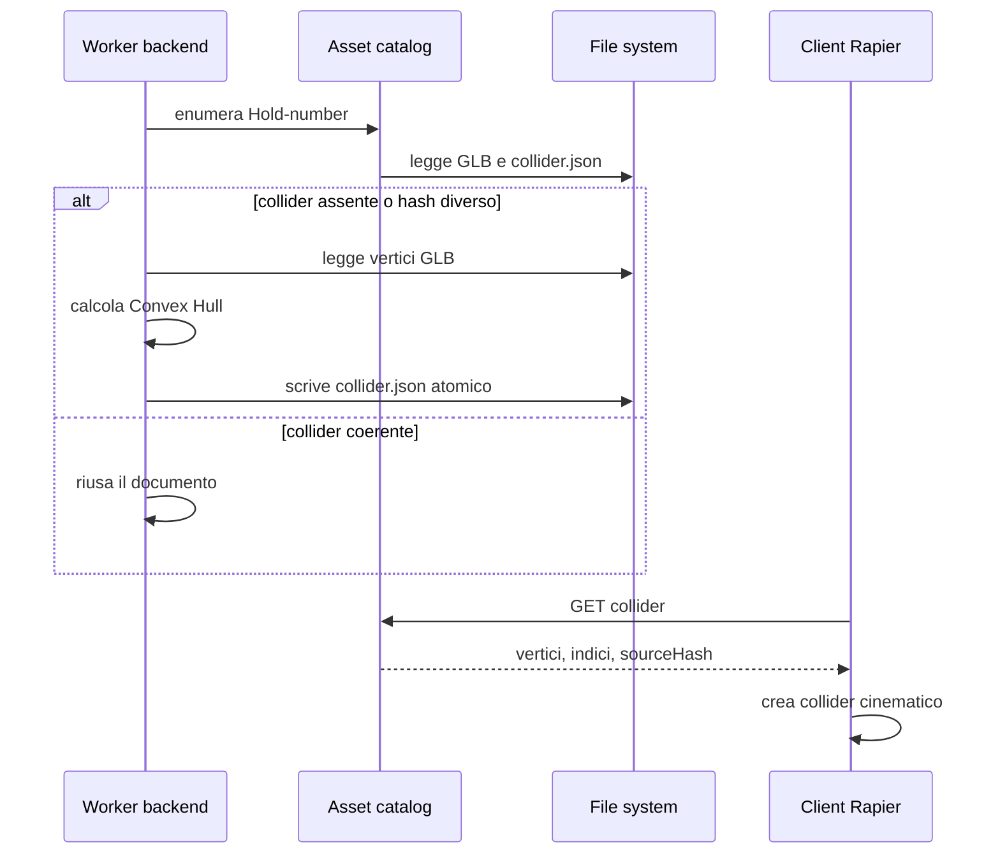
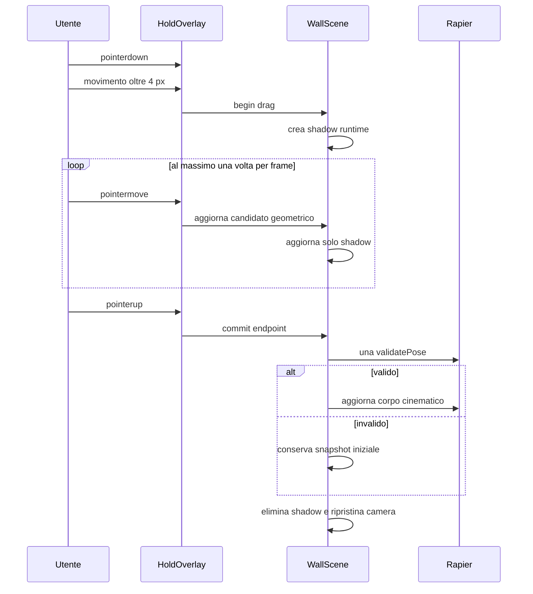

# Guida Applicativa E Tecnica

## Scopo

The Route Setter consente di comporre una tracciatura di arrampicata su una parete tridimensionale. Il browser visualizza la parete e il catalogo locale, crea le istanze delle prese, gestisce la fisica Rapier, il targeting, le trasformazioni e l'esportazione JPG. Il backend ASP.NET Core scopre e distribuisce gli asset, genera i collider Convex Hull mancanti e centralizza errori e log.

Non esistono account, autenticazione o persistenza delle tracciature. Lo stato della composizione vive esclusivamente nella sessione browser.

## Baseline E UX Attiva

Le fasi 0-9 costituiscono la baseline storica. Alcuni nomi tecnici e test conservano termini come `snap`, ma non descrivono più un aggancio automatico attivo.

Dalla fase 9UX la UX normativa è:

- selezione della presa con popup contestuale;
- `Dettagli`, `Aggancia`, `Sgancia`, `Ruota`, `Sposta` e `Rimuovi` nel popup;
- aggancio esplicito tramite mouse e shadow 3D aderente alla parete;
- movimento e rotazione con click incrementale oppure drag transazionale;
- preview shadow durante il drag e commit soltanto al rilascio;
- nessun comando legacy avanti/indietro e nessuna shortcut globale di trasformazione;
- `Escape` annulla la modalità, elimina la preview, deseleziona la presa e nasconde il popup.

## Architettura



Il backend non esegue la simulazione fisica. Il frontend mantiene separate la mesh grafica Three.js e il collider Rapier. La parete usa un TriMesh statico; ogni presa usa un rigid body cinematico con Convex Hull pre-calcolato.

## Struttura Dei Sorgenti



Gli asset sono esterni a `source`. Le cartelle delle prese devono rispettare `Hold<number>`. I sorgenti applicativi e di test sono contenuti in `source`; la documentazione stabile è in `docs`.

## API



| Metodo | Percorso | Scopo |
|---|---|---|
| `GET` | `/api/system/health` | Disponibilità del backend. |
| `GET` | `/api/wall` | Modello GLB della parete con supporto range. |
| `GET` | `/api/holds` | Manifest leggero delle prese, senza contenuto GLB. |
| `GET` | `/api/holds/{id}/model` | Modello GLB caricato on demand. |
| `GET` | `/api/holds/{id}/preview` | Immagine catalogo opzionale. |
| `GET` | `/api/holds/{id}/collider` | Documento JSON del Convex Hull pronto. |
| `GET` | `/api/holds/{id}/assets/{fileName}` | Asset opzionale appartenente alla presa. |
| `POST` | `/api/logs` | Evento diagnostico frontend sanitizzato e registrato lato server. |

Swagger UI è esposta su `/swagger`; il documento OpenAPI è `/swagger/v1/swagger.json`. Le risposte di errore non espongono stack trace o percorsi interni e includono gli identificatori di correlazione previsti.

## Lifecycle Della Presa



Lo stato fisico è `detached` o `attached`; la modalità UI è `idle`, `attach-targeting`, `moving` o `rotating`. Una sola presa e una sola sessione drag possono essere attive. `pointercancel`, perdita della capture, blur, rimozione e cambio selezione eseguono cleanup senza commit.

## Flusso UI



### Catalogo E Dettagli

Il manifest viene caricato una volta per sessione. Preview, modelli e collider sono caricati on demand. Il viewer `Dettagli` è condiviso tra catalogo e popup e rilascia renderer, controlli e risorse alla chiusura. I modelli con lo stesso URL condividono download, parsing, geometrie e texture tramite reference counting.

### Targeting E Aggancio

La shadow gialla segue il ray centrale e orienta l'asse locale `+Z` sulla normale della parete, conservando il twist. Il footprint della base non è disegnato, ma genera 37 campioni deterministici. Al click gli hit sono raggruppati per continuità e compatibilità delle normali; il gruppo dominante determina punto e normale. Una posa invalida non modifica la presa e rende temporaneamente rossa la shadow.

### Movimento E Rotazione

Il click sulle frecce muove di `1 cm` o ruota di `1°`. Oltre la soglia pointer di `4 px`, il gesto diventa una transazione: la presa reale e il collider restano invariati, la shadow mostra il candidato e il rilascio esegue una sola validazione endpoint. Il movimento da freccia è vincolato all'asse; quello iniziato sulla presa usa entrambe le dimensioni dello schermo. Il movimento segue la superficie entro `5°` e si arresta su gap o discontinuità.

### Export

`Genera immagine` produce un JPG con lato lungo `2560 px`, rapporto della viewport e qualità `0.90`. Il render temporaneo conserva camera e sfondo, esclude DOM, evidenziazioni, shadow e indicatori e ripristina sempre lo stato nel `finally`. Il comando è disabilitato durante un drag.

## Responsabilità Backend E Frontend



## Flusso Convex Hull



## Flusso Drag Transazionale



## Configurazione

Il backend legge `source/backend/src/TheRouteSetter.Api/appsettings.json`:

- `AssetStorage.RootPath`: radice che contiene `main-wall` e `holds`;
- `AssetStorage.MainWallDirectory`: directory della parete;
- `AssetStorage.HoldsDirectory`: directory delle prese;
- `Logging.FilePath`: pattern file Serilog;
- `Logging.RetentionDays`: retention, valore predefinito 7;
- `Logging.QueueCapacity`: capacità della coda asincrona.

Le variabili d'ambiente ASP.NET Core possono sovrascrivere i valori con la sintassi `Sezione__Chiave`, per esempio `AssetStorage__RootPath`.

Il frontend usa:

- `E2E_FRONTEND_PORT` e `E2E_BACKEND_PORT` per la suite E2E;
- `PERF_FRONTEND_PORT`, `PERF_BACKEND_PORT`, `PERF_HEADLESS`, `PERF_DURATION_MS` e `PERF_HOLD_COUNT` per il benchmark.

## Avvio Live

Prerequisiti: .NET SDK `8.0.424`, Node.js `22.18.0`, npm `10.9.3` e browser WebGL 2.0.

Backend, dalla cartella `source`:

```powershell
dotnet restore .\TheRouteSetter.sln --locked-mode
dotnet run --project .\backend\src\TheRouteSetter.Api\TheRouteSetter.Api.csproj --launch-profile http
```

Frontend, dalla cartella `source/frontend`:

```powershell
npm ci
npm run dev -- --host 127.0.0.1
```

Aprire `http://127.0.0.1:5173`. Il proxy Vite inoltra `/api` a `http://127.0.0.1:5080`.

## Avvio Debug

Backend con hot reload, dalla cartella `source`:

```powershell
dotnet watch --project .\backend\src\TheRouteSetter.Api\TheRouteSetter.Api.csproj run --launch-profile http
```

Frontend con HMR e source map, dalla cartella `source/frontend`:

```powershell
npm run dev -- --host 127.0.0.1
```

Usare DevTools del browser per TypeScript/WebGL e il debugger .NET dell'IDE collegato al processo API. Lo snapshot `window.__ROUTE_SETTER_SCENE__` è diagnostico per gli E2E; la telemetria `window.__ROUTE_SETTER_PERFORMANCE__` esiste solo con query string `?performance=1`.

## Errori E Logging

Il middleware assegna un identificatore di correlazione alla richiesta e converte le eccezioni nel contratto HTTP previsto. Serilog scrive JSON in modo asincrono, con livello minimo configurabile e retention giornaliera. Il frontend mostra messaggi non tecnici e invia al backend solo eventi diagnostici essenziali; non conserva log persistenti nel browser.

## Risoluzione Problemi

- `Parete non disponibile`: verificare `AssetStorage.RootPath`, la cartella `main-wall` e `GET /api/wall`.
- Presa senza pulsante `Utilizza`: verificare `colliderStatus` nel manifest e la presenza di `collider.json`.
- Errori proxy frontend: verificare che il backend ascolti sulla porta `5080` o impostare `E2E_BACKEND_PORT` coerentemente.
- WebGL non disponibile: aggiornare driver/browser e verificare l'accelerazione hardware.
- Benchmark a pochi FPS in headless: eseguire headed; SwiftShader e il throttling RAF non certificano il profilo hardware.
- Porta occupata: terminare il processo esistente o impostare le variabili porta supportate dalle configurazioni Playwright/Vite.
